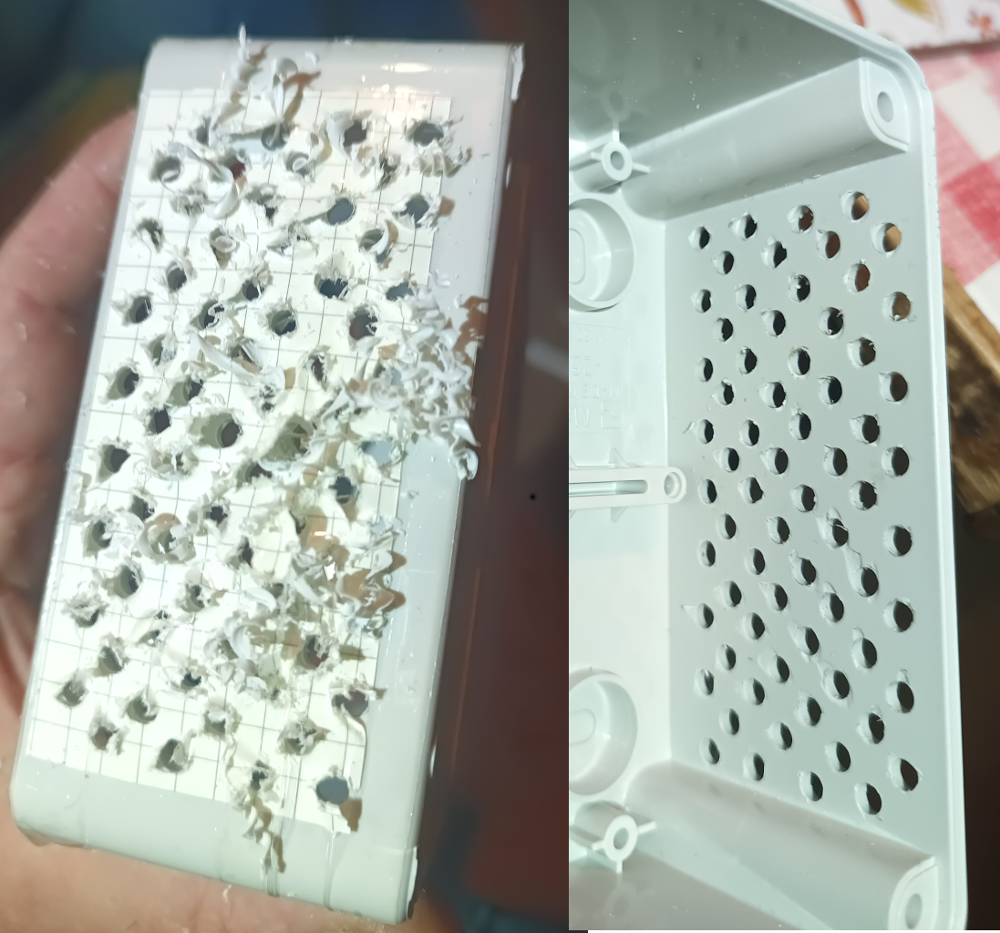
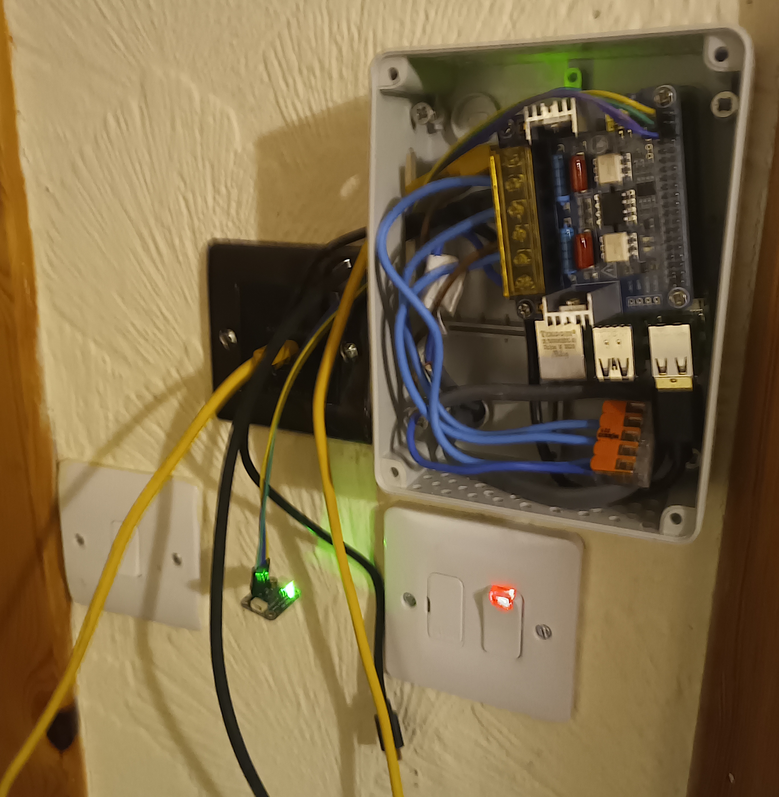
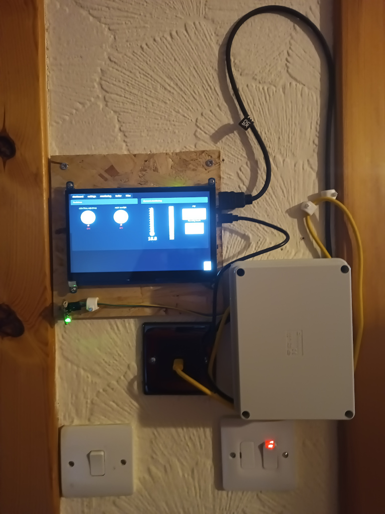
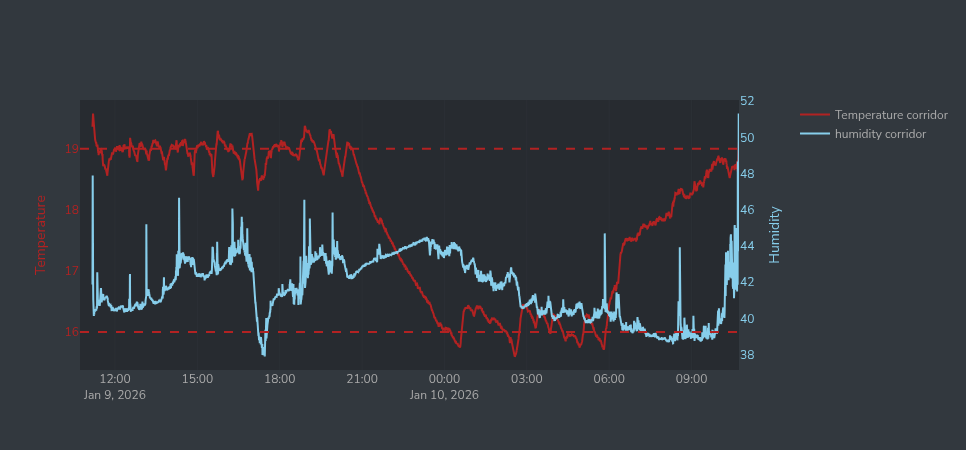
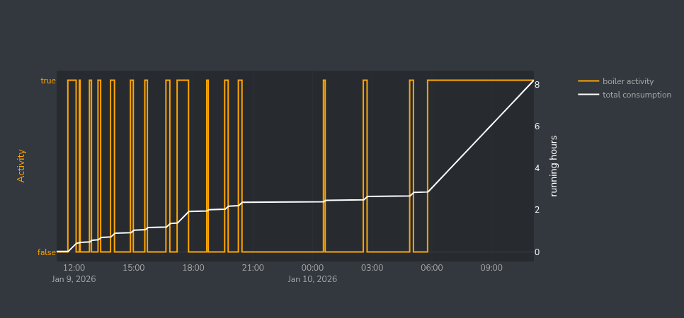

# Boiler_controler (in progress)
A way to control a Grant Combi boiler with a raspberry pi 5 with Python and Dash

## BOM
* Raspberry pi 5 4Go (probably oversized)
* 5 amp switch for mains
* 2 channel Triac from Waveshare https://www.waveshare.com/wiki/2-CH_TRIAC_HAT
* Temperature and humidity sensor from Pimoroni SHT45 (others will do)
* 4 jumper cables
* 4 ways connector (or bus bar)
* A USB-C PD wall socket
* USB-C cable
* A 7" touchscreen from Waveshare
* HDMI to micro-HDMI cable
* Micro-USB - USB (B?) to control the touchscreen
* optional derivation box, vented enclosure etc 

## Hardware setup 
In my case, the boiler had a control unit that was only a timer. So I had a spur from my consumer unit to a central place in the house with a switchable 5A blow fuse. Grant recommends 5A to protect the boiler. Personally I would have preferred a 5A breaker in the consumer unit rather than a switch you could mistake for the nearby light switch.
* Switch off the spur of the mains
* Choose a space to place your screen backplate, the USB C PD wall socket and the RPi enclosure. Fix them all / mark them, beware of cable lengths etc. In my case I had to "vent" the enclosure. The RPi5 generates a lot of heat so it is really necessary.


* Connect main to switch input
* connect switch output to boiler supply, to USB-C PD wall socket.
* Pull a 2 core wire (L/N) from USBC wall socket to RPi enclosure. Connect live core to inlet of Triac, neutral to a 4-ways connector.
* Place the Triac hat on the raspberry header. Use spacers to maintain it securely. use spacers to add piece of enclosure away from Triac radiator.
* from the 4 ways connector, pull 3 neutral cores to each neutral of the Triac. Neutral is shared and only live will send instructions to boiler.
* Pull a wire with 2 cores for live of Central Heating (CH) and instant Hot Water (HW) from the boiler to the place you are setting up. The schematics are in Grant boiler manuals with a 5 cores connector. In my case that was already there.
* connect live from CH to live channel 1 of Triac, connect live HW to channel 2
* Set Triac to use I2C communication (switch + 2 jumpers to move)
* connect jumper cables to Triac header for power supply and I2C. Connect jumper cables to the temperature and humidity sensor. Keep the sensor away from screen and enclosure to not disturb readings


* connect screen to raspberry (HDMI+USB)
* connect USB-C to power socket (don't power up yet)
* obviously there will be plenty of work setting this on a wall you can make it complicated or simple. At the moment it is a prototype so I simply use backplates and screw them on the plasterboard as I know that wall will be demolished in the future.

## setting up the pi
* Flash a card with an appropriate OS. I used the recommended at the time Debian Trixie. setup for ssh, activate I2C
* Fire up the pi.
* Create a folder to put the project, I made one handy on the desktop for debugging: `mkdir ~/Desktop/ch`
* create a python virtual environment `python -m venv /path/to/new/virtual/environment`
* activate it `source python -m venv /path/to/new/virtual/environment/bin/activate`
* install the requirements.txt with pip `pip install -r /path/to/requirements.txt`
* For the Waveshare Triac, download this archive https://files.waveshare.com/upload/e/ef/2-CH_SCR_HAT_code.7z. Within the archive, `2-CH_SCR_HAT_code/RaspberryPi/python/lib/` copy the folder `waveshare_2_CH_SCR_HAL` in your virtual environment `/path/to/new/virtual/environment/lib/python3.12/site-packages/`. Waveshare like a lot of hardware provider recommend to sudo and open all your files. This is very bad practice and could compromise your system and make it vulnerable.

## Startup the script
Open a shell in your project, run `python3 dashprod.py`
open http://localhost:8888/ with your favourite browser, chromium is the RPi default one and it does the job. I recommend to press F11 to put it full screen. And tadaaah!



You can live edit the script for different layouts, levels of logging etc. As long as you don't break the script it will restart automatically.

## automating the script at startup
Write a file `ch.service` with the text editor. Change `user` with your user name in the `[service]` description
```
[Unit]
Description=Smart home control
Wants=network-online.target
After=network-online.target

[Service]
WorkingDirectory=/home/user/Desktop/ch
RuntimeDirectory=run/ch
Environment="script_path=/home/user/Desktop/ch" "LG_WD=/tmp"
ExecStart=/path/to/new/virtual/environment/bin/python3 /home/user/Desktop/ch/dashprod.py
User=user

[Install]
WantedBy=multi-user.target
```

Allow system to execute it

```
chmod 755 ~/Dekstop/ch/dashprod.py
```

Place the file in systemd

```
sudo nano /etc/systemd/system/ch.service
```

Reload all daemons

```
sudo systemctl daemon-reload
```

Enable your service

```
sudo systemctl enable ch
```
Start your service

```
sudo systemctl start ch
```


## Interface

### Dashboard tab

Provides the current situation. Allows to switch on hot water, shows state of central heating (following thermostat). Shows current temperature and humidity and shows total running hours.

### Setting tab

Allows to setup the minimum temp (default 16) and maximum temperature (default 19)
Allows to setup the interval during the day for the high temperature (default 5:45-20:30).
Notice that after a power cut you will have to reset that except if you modify `dashprod.py`.

``` python
variables['lt']=16
variables['ht']=19
variables['timer']=[5.75,20.5] #in decimal hours
```

### Monitoring tab

Produces a graph of temperature and relative humidity through time. Also shows the high and low temperature limits of the setting tab. The width (time range) of the plot is specified in the `Misc tab`.



### Boiler tab

Produces a graph of when the boiler is on (true) and the cumulative hours of use __since it booted__. If you want the total hours by cumulating all the hours since starting logging check led display in `dashbard tab`. The width (time range) of the plot is specified in the `Misc tab`.



### Misc tab

Setup the width of the plots in hours by 12h sections up to 7 days.
(TODO) PID will move there
(TODO) boiler stats, expected consumption?

## TO DO
* Screensaving: at the moment it doesn't wake up when activated could be an OS issue.
* Better tooltips
* Correct crash when log is empty
* Integrate data from former logs after power cuts
* add a reset boiler hours when you fill the tank.
* add more running hour stats
* add a consumption interface to integrate the added fuel (tricky without knowing when firing the burner compared to only circulating hot water).

  
  

